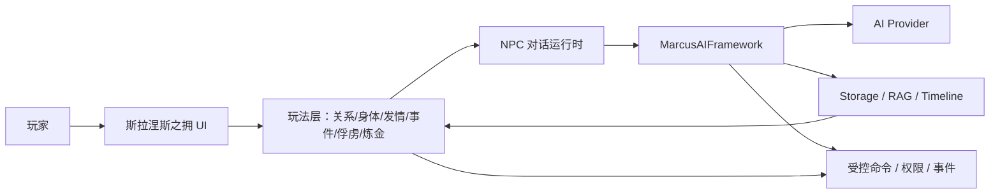

# 取代 AF · 自建 AI 世界模组战略

> 日期：2026-08-14
> 目标：让 `SlaaneshsEmbrace` 成为不依赖 AnimusForge、不依赖爱与恨的完整 AI 世界模组，替代 AF 系列在玩家侧的体验。
> 前提：`MarcusAIFramework` 是唯一 AI 底层；AF 系列只作为内容与设计参考来源，不作为依赖。

## 1. 要取代的东西

AF 不是单一个模组，而是由多层组合构成：

| 层 | 代表模组 | 玩家侧能力 | 替代者 |
| --- | --- | --- | --- |
| 基础对话壳 | AnimusForge + DialogueFormatter | NPC AI 对话、请求外壳、对话发送与历史、自定义提示词 | 斯拉涅斯之拥 NPC 对话运行时 + Marcus 逻辑 Route |
| 关系引擎 | AnimusForgeRelationshipPatch（爱与恨） | 七项私人关系、恋爱阶段、事件账本、共同回忆、俘虏/营地/海上玩法 | 斯拉涅斯之拥关系系统 + 事件账本 + 权力关系系统 |
| 齁改玩法 | AnimusForgeHoukai | 身体开发、发情周期、388 事件、女神/炼金/禁忌、世界效果 | 斯拉涅斯之拥事件库 + 身体/发情/神术/炼金/禁忌 + 世界命令 |
| 高级 AI 内容 | AF CustomPrompts / PlayerExports | 周报、世界外交、统治者政策、NPC 人格生成、记忆压缩 | Marcus Prompt + Storage + 斯拉涅斯之拥任务路由 |

## 2. 替代架构

关键边界：

- 玩家和游戏只接触 `SlaaneshsEmbrace`。
- AI 请求全部走 Marcus 逻辑 Route，不直接写 HTTP、不保存 Key。
- 所有关系、身体、发情、金币、声望等改动都走 Marcus 受控命令。
- 所有记忆、履历、周报都走 Marcus Storage/Timeline。
- 不读 AF 状态，不反射 AF 内部签名，不 Harmony patch AF。

## 3. 能力对照与替代优先级

| AF 能力 | 替代实现 | 现状 | 优先级 |
| --- | --- | --- | --- |
| 任意 NPC AI 对话 | NpcDialogueService + 逻辑 Route + 角色卡 | A25 已有主动邀约对话，未覆盖任意英雄/任意地点 | P0 |
| 主动 NPC 发起 | NpcProactiveBehavior + 概率/开场/待续 | 已有基础 | P0 |
| 玩家情报与场景上下文 | Player/Hero/Kingdom/Settlement/World Provider | player/hero/relationship 已有，世界快照缺失 | P0 |
| NPC 记忆与日压缩 | Storage + memory.daily/memory.major Prompt | route 已建，压缩逻辑未闭环 | P0 |
| 自定义玩家提示词 | MCM 自定义 Prompt + Marcus Prompt Registry | 无 | P1 |
| 七轴关系与恋爱阶段 | relationships namespace + relationship.delta | 信任/爱意/敌意已有，七轴与阶段未全 | P1 |
| 事件账本与共同回忆 | EventService + 世界账本 + 档案 UI | 基础账本已有 | P1 |
| 俘虏/营地/海上 | 权力关系系统 + 场景事件 | 俘虏/营地基础已有，海上未做 | P1 |
| 身体开发 | body_state + body.develop + 9 分区 7 档位 | 已有分区，公式/档位待搬 | P1 |
| 发情周期 | estrus.tick + 7 天 5 阶段 | 已有 7 天，5 阶段文案待搬 | P1 |
| 388 条事件 | 数据驱动事件库 + EventEngine | 代码硬编码少量测试事件 | P1 |
| 炼金/禁忌 | AlchemyCore + 工作台/仪式命令 | 无 | P2 |
| 世界效果 | 金币/声望/影响力/士气/技能/关系命令 + 日限 | 无 | P2 |
| 周报/季报 | report route + 事件摘要 | 周报基础已有 | P2 |
| 世界外交/政令/叛乱 | WorldEvent + policy/bulletin route | 无 | P3 |
| NPC 人格生成 | persona generation route + 角色卡 | 无 | P3 |
| 记忆压缩三级 | daily/major/overview | 仅 route 名 | P3 |

## 4. 分阶段执行

### Phase A：取代 AF 对话壳

- 通用 NPC 对话：任意英雄、任意地点、主动与被动发起、会话历史。
- 完整上下文：玩家、当前 NPC、王国、定居点、队伍、世界快照。
- NPC 记忆：单 NPC 记忆、日压缩、重大事件摘要。
- 输出契约：reply/mood/actions 等结构化 Schema。

验收：

- 不安装 AF 也能进入任意 NPC 对话。
- NPC 记得上次会话，跨天不丢失。
- 日志出现 register_ok、npc_dialogue_submit_accepted、memory_daily_completed。

### Phase B：取代爱与恨关系引擎

- 七项私人关系：友情、爱情、身体吸引、当前性欲、敌意、畏惧、信任。
- 恋爱阶段、共同回忆、事件账本、关系履历。
- 关系结算只走 `relationship.delta`，不读 AF 兼容数据。
- 存档健康与旧档迁移。

验收：

- 关系可结算、可显示、可存读档。
- 主动与事件产生的变化全部可追溯。
- 卸载爱与恨后关系仍完整。

### Phase C：取代齁改玩法

- 388 条事件数据驱动化：条件、权重、冷却、选项、Aftermath、事件链。
- 身体 9 分区、7 档位、开发公式。
- 发情 7 天 5 阶段与强度。
- 俘虏/营地/玩家被俘合并权力关系系统。
- 世界效果命令 + 每日限幅。

验收：

- 事件可触发、可结算、可存读档。
- 男女视角与身份视角分支完整。
- 世界效果真实生效且不刷爆日限。

### Phase D：取代 AF 高级 AI 内容

- 周报/季报、世界公告、政令效果。
- 世界外交、王国叛乱、NPC 统治者政策。
- 玩家自定义提示词。
- NPC 人格生成与角色卡。

验收：

- AI 生成内容只做叙事与建议，效果全部走受控命令。
- 玩家自定义提示词可影响风格，不能绕过权限。

### Phase E：收尾与独立验证

- 移除 AF 系列依赖，只用 Marcus + 四前置 + SlaaneshsEmbrace。
- 验证新档与旧档迁移。
- 发布包不含 AF 内容与 AF 代码。
- 可选：通过 CapabilityBroker 与其他模组兼容。

## 5. 关键原则

- AF 是内容来源，不是依赖来源。
- 不迁移 AF 反射、Harmony、状态桥、插件事件注册。
- 所有 AI 调用走 Marcus 逻辑 Route。
- 所有持久状态走 Marcus Storage。
- 所有效果走受控命令。
- 内容可搬运，代码全部自建。
- 分阶段提版，不按功能数量虚高版号。

## 6. 风险

- AF 依赖的第三方模组若仍存在，需要 CapabilityBroker 兼容。
- 玩家旧存档与 AF 关系数据需要迁移策略。
- AI Provider 配置与权限弹窗稳定性仍是外部风险。
- 388 条事件与四版世界书迁移工作量大，需要分批。
- 通用 NPC 对话覆盖全英雄需要足够稳定的人物信息与记忆，否则容易出戏。
